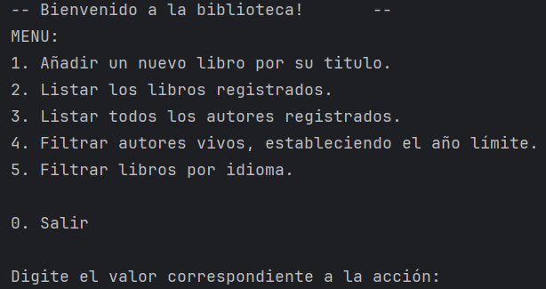

# LiterAlura - Challenge

Para empezar, ejecutaremos el programa por consola, y nos desplegará el siguiente menú:

Después ya podemos seleccionar la opción que deseemos consultar.

<b>Recomendaciones:</b>

En la opción 5: <i>"Filtrar libros por idioma"</i>,  Es necesario escribir el idioma en español, con sus acentos correspondientes.

Actualmente soporta los idiomas: <b>Inglés, Francés, Español y Portugués.</b> 

~ La base de datos establecida en las propierties tiene el nombre de <b>literalura_db"</b>. Si estás teniendo problemas en la ejecución del programa puede deberse a esto. 

